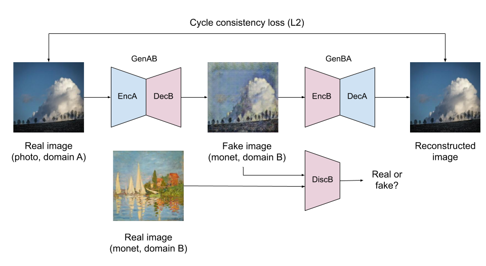
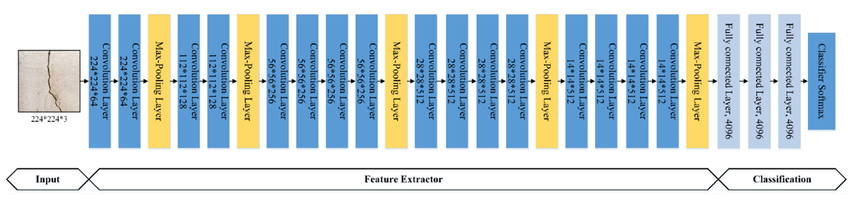

# Artistic Style Transfer with CycleGANs and VGG-19

## Overview

This project explores two different approaches to artistic style transfer: CycleGANs and Neural Style Transfer (NST) using the VGG-19 model. CycleGANs are trained to transform ordinary photographs into Monet-style paintings, while the VGG-19 model enables fast and efficient style transfer with pretrained weights. Users can experiment with both methods to apply various artistic styles to their images and compare the results.

## CycleGAN Architecture



The CycleGAN architecture consists of two main components: generators and discriminators. Generators learn to translate images from one domain to another (e.g., photos to Monet-style paintings), while discriminators distinguish between real and generated images. Through adversarial training, CycleGANs can effectively capture the style of a given artist (e.g., Monet) and apply it to input photographs.

**Libraries used:**
- TensorFlow
- TensorFlow Addons (for CycleGAN)

## VGG-19 Architecture



The VGG-19 architecture is a deep convolutional neural network pretrained on large-scale image classification tasks. It comprises multiple convolutional and pooling layers, followed by fully connected layers. For artistic style transfer, VGG-19 is used to extract feature representations from both the content and style images. By minimizing the content and style differences between the generated image and the input content image, VGG-19 achieves style transfer.

**Libraries used:**
- TensorFlow
- NumPy

## Getting Started

1. Clone this repository:
   ```bash
   git clone https://github.com/your_username/artistic-style-transfer.git

2. Explore the provided Jupyter notebooks for CycleGAN and VGG-19 implementations.
3. Experiment with different images and artistic styles to experience the power of artistic style transfer.

## Credits

- CycleGANs implementation inspired by [CycleGAN-TensorFlow](https://github.com/LynnHo/CycleGAN-Tensorflow)
- VGG-19 implementation adapted from [pytorch-cnn-visualizations](https://github.com/utkuozbulak/pytorch-cnn-visualizations)

## License

This project is licensed under the MIT License - see the [LICENSE](LICENSE) file for details.
